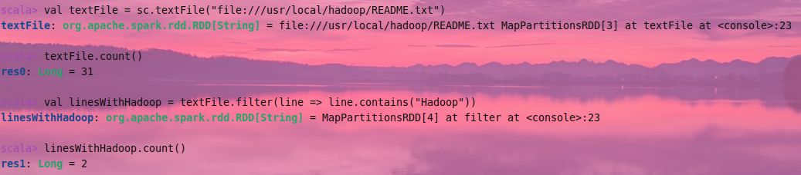
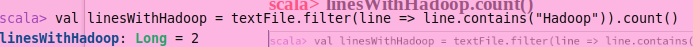
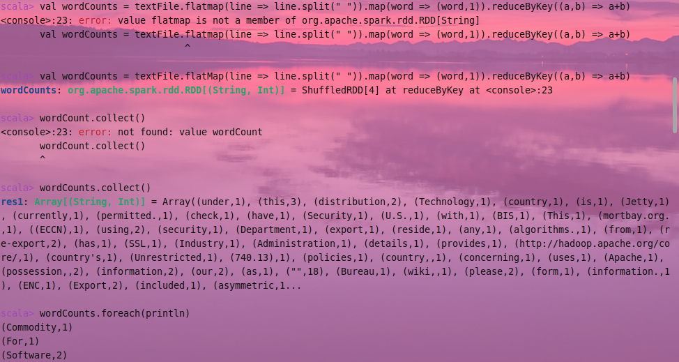
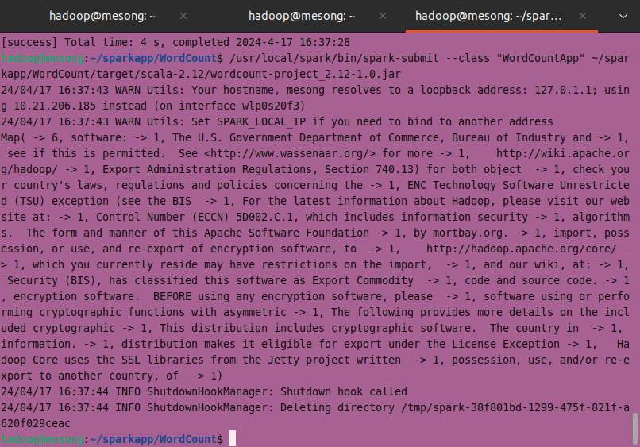
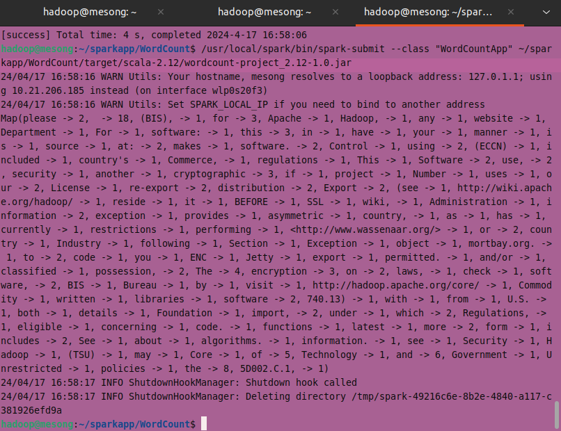
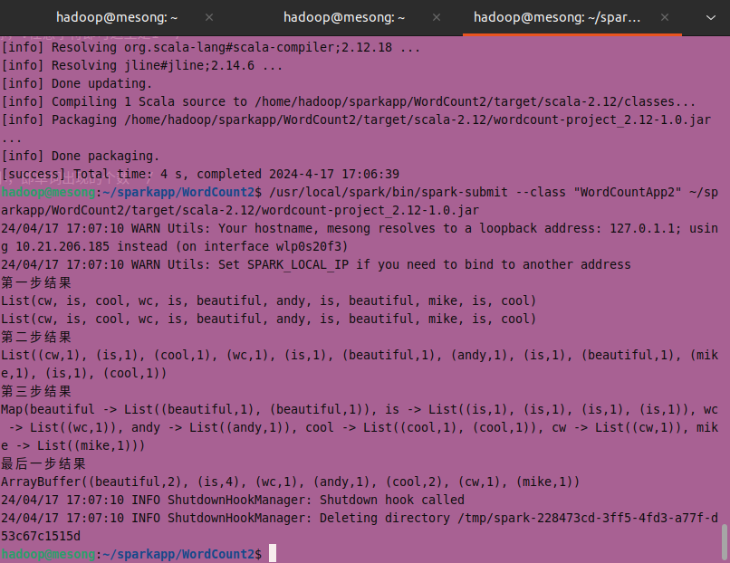
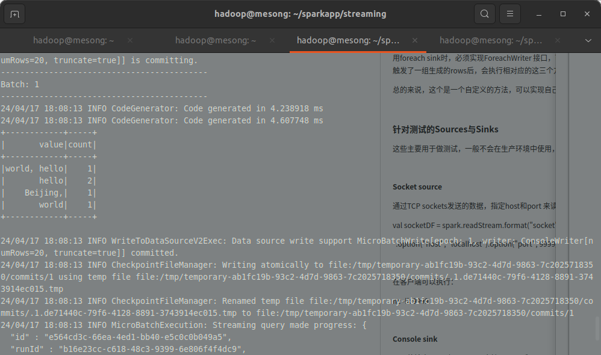

[toc]
# 2.1 spark
版本
spark3.5.1
scala2.12.18
java1.8.401
1. 安装目录
`/usr/local/spark`
2. 进入scala环境
`cd /usr/local/spark/bin`
`./spark-shell`

# 2.2 wordCount
## 2.2.1 命令行
1. 统计Hadoop单词个数

2. 每个单词个数
（原文档flatmap应是flatMap）

## 2.2.2 Scala程序

- Scala原生：

# 2.3 Spark Streaming
需要开启新终端，输入
`nc -lk 9999`
然后输入需要统计的字符串

关闭端口所在的终端后，再次开启端口输入字符串，就无法获得单词统计了